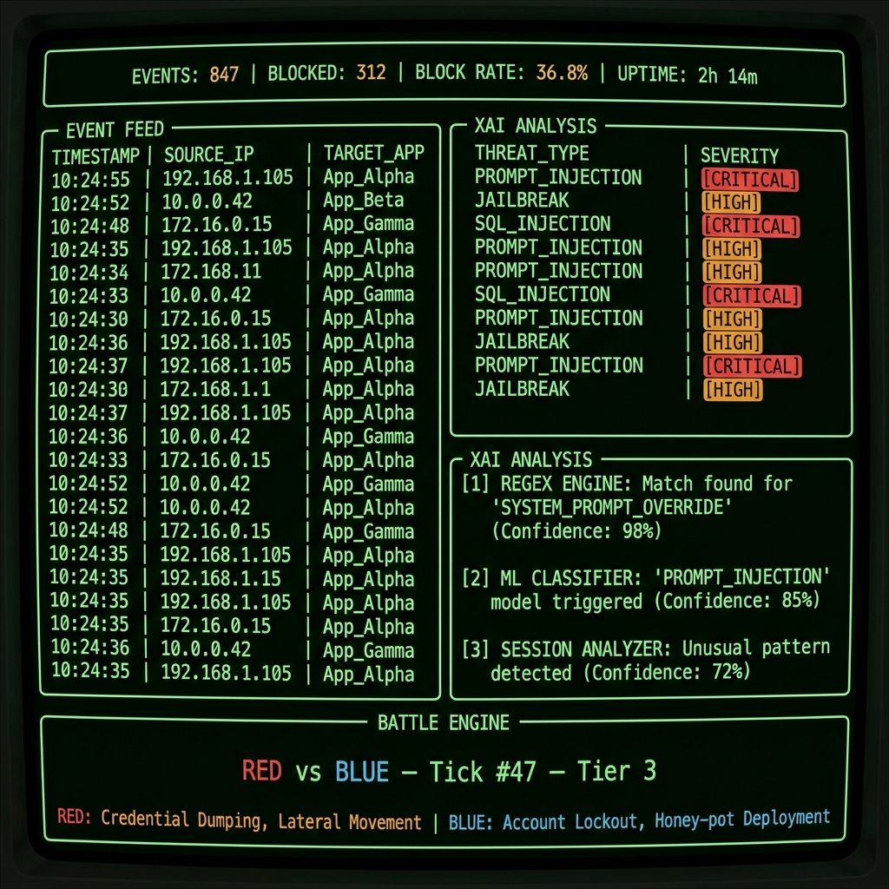
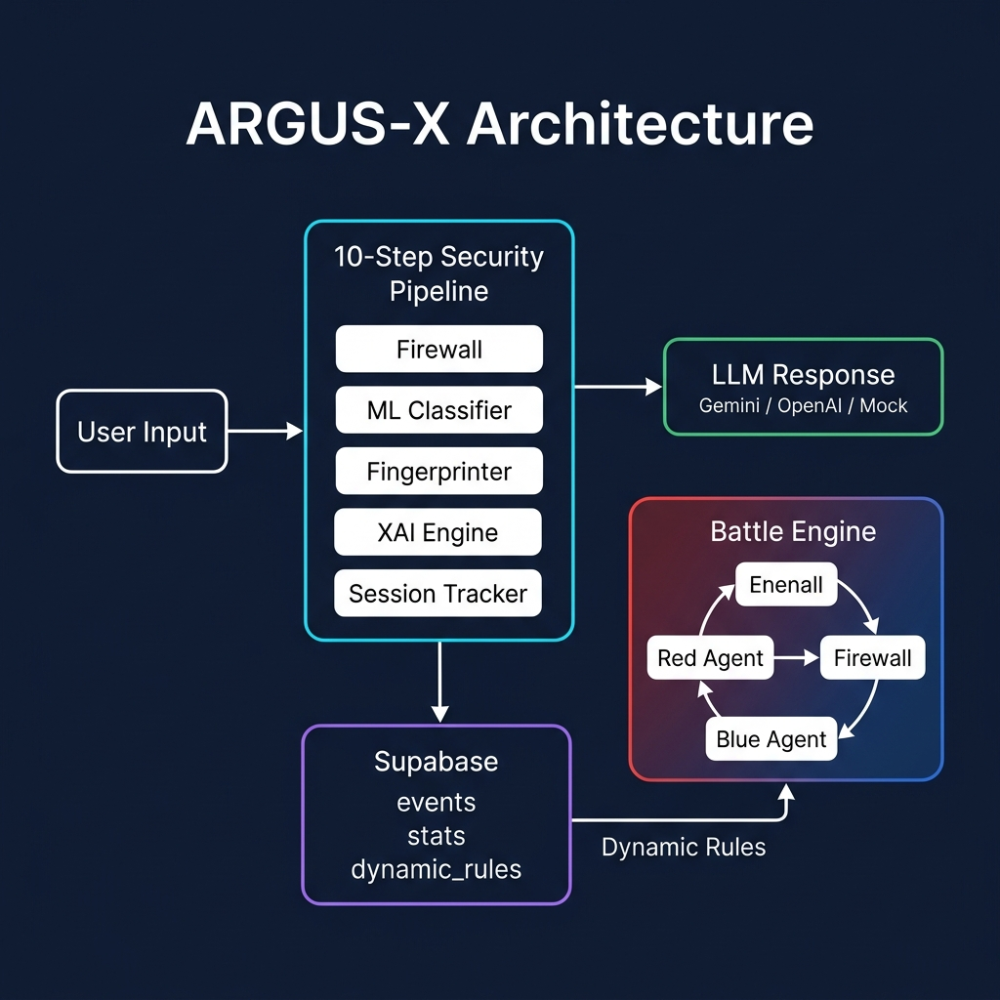

# ARGUS-X

**Autonomous defense system for LLM applications.** Catches prompt injections before they reach your model, explains why it blocked them, and teaches itself new attack patterns overnight.

Built this as a deep dive into AI security — wanted to understand what it actually takes to protect a language model in production, not just throw a regex at it and call it a day.



---

## What it does

Every message goes through a 10-step security pipeline before touching the LLM:

1. **API key validation** — BYOAK (Bring Your Own API Key) model, zero credential storage
2. **Session threat tracking** — escalating risk levels per session (LOW → CRITICAL)
3. **Regex firewall** — 30+ handcrafted patterns covering 6 attack categories
4. **ML classifier** — ProtectAI DeBERTa v3 running ONNX inference, catches what regex can't
5. **LLM response generation** — Gemini 2.0 Flash / OpenAI / mock fallback chain
6. **Attack fingerprinting** — SHA256 identity + 10 heuristic signals → sophistication score 0-10
7. **XAI engine** — 3-layer explainability (why was this blocked? how confident? what next?)
8. **Session update** — cumulative threat tracking with auto-escalation
9. **Response construction** — everything bundled into a typed response
10. **Background tasks** — async DB logging, mutation engine, campaign correlation

If the firewall misses something, the ML model catches it. If both miss it, the battle engine finds the gap and patches it autonomously.



## The battle engine

This is the part I'm most proud of. It's a continuous Red vs Blue adversarial loop:

- **Red Agent** (Gemini-powered) generates increasingly sophisticated attacks across 5 tiers — from naive keyword injections up to multi-step obfuscated payloads
- **Firewall** tries to catch them
- **Blue Agent** analyzes any bypasses, generates new regex rules, validates them against ReDoS and false positives, and deploys them to Supabase
- The firewall reloads the new rules. Rinse and repeat every 60 seconds.

The system literally attacks itself to get stronger. Every rule the Blue Agent writes goes through triple validation (syntax check → adversarial timeout test → false-positive test against safe strings) because LLMs are terrible at writing safe regex.

## The TUI

Built a full terminal interface using Textual instead of a web dashboard. It's faster, more distinctive for a security tool, and I didn't have to deal with React.

**Panels:**
- **StatsBar** — events, blocks, block rate, uptime, sparkline
- **Event Feed** — live-scrolling security event table with threat type badges
- **XAI Pipeline** — real-time 3-layer analysis breakdown with confidence bars
- **Battle Engine** — Red vs Blue contest view, tick counter, tier display
- **Input Panel** — dual-tab (HR Assistant for clean chat, Attack Console with F1-F6 presets)

9-color design system. Every color defined once in `theme.py`, used everywhere.

## Tech stack

| Layer | Tech | Why |
|---|---|---|
| Backend | Python 3.14, FastAPI, Uvicorn | Async-native, Pydantic validation on every boundary |
| ML | ONNX Runtime + tokenizers | 15MB runtime vs 700MB+ for PyTorch. CPU only, no CUDA needed |
| Database | Supabase (PostgreSQL) via raw httpx | supabase-py broke on Python 3.14, so I built a direct PostgREST client |
| LLM | Gemini 2.0 Flash | Free tier, fast enough for real-time security decisions |
| TUI | Textual | Professional terminal UI, no web security surface to worry about |
| Deploy | Railway | Single container, env-based config |

## Security hardening

This system went through 3 rounds of auditing:

**Security Audit (11 fixes):** Body size limits, rate limiting (dual-tier), 7 security headers, HMAC auth with constant-time comparison, SHA256 fingerprinting, CORS lockdown, custom error handlers that don't leak internal paths.

**Architecture Review (9 fixes):** Pipeline extraction from a 290-line route handler into a testable service, Gemini circuit breaker (prevents 30s cascading timeouts), PostgreSQL RPC for atomic stats, request correlation IDs via `contextvars`, real database health checks.

**Master Audit (3 cosmetic fixes):** Line-by-line read of every file. Found nothing significant, which was the point — the previous rounds did their job.

Some things I'm especially careful about:
- API keys are **never** logged, stored, or returned. 4 redaction patterns in the logger.
- The firewall is **fail-closed** — if `analyze()` crashes, it returns `blocked=True`
- `asyncio.CancelledError` is **always** re-raised — I had a shutdown hang bug that taught me this the hard way
- Every regex pattern is ReDoS-safe — bounded quantifiers, no nesting, compiled at module load

## Running locally

**Backend:**
```bash
cd backend
source venv_linux/bin/activate   # or create one: python -m venv venv && pip install -r requirements.txt
python main.py                   # starts on :8000
```

**TUI:**
```bash
cd frontend/cli
pip install textual httpx python-dotenv
python main.py
```

**Environment variables** (in `backend/.env`):
```
GEMINI_API_KEY=your_key          # from aistudio.google.com
SUPABASE_URL=your_project_url
SUPABASE_KEY=your_service_role_key
DASHBOARD_READ_KEY=any_32byte_random_string
ENVIRONMENT=development
BATTLE_ENABLED=true
ML_ENABLED=true
```

For the TUI, create `frontend/cli/.env`:
```
ARGUS_API_URL=http://localhost:8000
ARGUS_DASHBOARD_KEY=same_as_DASHBOARD_READ_KEY
```

## Running tests

```bash
cd backend
source venv_linux/bin/activate
pytest -v                        # 33 tests — needs the server running
```

Tests cover: pipeline routing, attack classification (5 threat types, parametrized), session escalation, auth enforcement, security headers, rate limiting burst, battle state, campaign detection.

## Project structure

```
backend/
├── main.py                  # FastAPI app, middleware, lifespan
├── config.py                # Pydantic settings (env-based)
├── services/
│   └── pipeline.py          # the 10-step security pipeline
├── security/
│   ├── firewall.py          # regex firewall (static + dynamic rules)
│   ├── ml_classifier.py     # ONNX DeBERTa inference
│   ├── xai_engine.py        # 3-layer explainability
│   ├── fingerprinter.py     # attack identity + sophistication scoring
│   └── mutation_engine.py   # Gemini-powered variant generation
├── agents/
│   ├── battle_engine.py     # Red vs Blue loop orchestrator
│   ├── red_agent.py         # tier 1-5 attack generator
│   ├── blue_agent.py        # bypass analyzer + rule patcher
│   └── correlator.py        # campaign detection across sessions
├── routers/                 # FastAPI route handlers (thin)
├── schemas/                 # Pydantic models for everything
├── utils/
│   ├── llm.py               # BYOAK wrapper + circuit breaker
│   ├── db.py                # Supabase httpx client
│   ├── session.py           # in-memory threat tracker
│   ├── auth.py              # HMAC dashboard key validation
│   ├── context.py           # correlation ID (contextvars)
│   └── logger.py            # redacting formatter
└── tests/                   # 33 integration tests

frontend/cli/
├── main.py                  # Textual app
├── theme.py                 # 9-color design system
├── api.py                   # async httpx client (Result types)
├── widgets/                 # StatsBar, EventList, XAIPanel, BattlePanel, InputPanel
└── screens/                 # API key gate

docs/
├── ARCHITECTURE.md          # decision log + constraints
infra/
└── schema.sql               # Supabase table definitions + RLS
```

## Known limitations

Being honest about what this system doesn't do:

- **Single instance only.** 7 in-memory components (session tracker, correlator, rate limiter, battle engine, circuit breaker, mutation cooldown, dynamic rule cache) break under multi-instance. All documented in `ARCHITECTURE.md`. Fixing this requires Redis/external state (~28h of work).
- **Gemini lock contention.** `genai.configure()` is process-global. Concurrent calls are serialized via a threading lock. Under heavy load, this becomes a bottleneck. The SDK doesn't support per-request clients cleanly.
- **5-minute dynamic rule staleness.** When the Blue Agent writes a new rule, the firewall might not see it for up to 5 minutes (cache TTL). Acceptable for defense-in-depth but worth knowing.
- **No structured logging.** Logs are plain text. A JSON formatter would enable Railway log search by field. ~2h to add.

## What I learned

Building this taught me more about production security than any course:

- Defense in depth isn't optional. The ML model catches attacks that regex fundamentally can't (semantic meaning vs pattern matching).
- `asyncio.CancelledError` will ruin your week if you swallow it. It's not an error — it's a shutdown signal.
- LLMs are terrible at writing regex. Every Blue Agent pattern needs automated validation.
- Fail-closed > fail-open, always. If your security layer crashes, it should block everything, not allow everything.
- BYOAK solves the API key management problem completely. Don't store what you don't need.

---

*~6,500 lines · 45+ files · 33 tests · 23 security & architecture fixes · 0 known vulnerabilities*
